# EpicBook on Azure - Production-Grade Terraform Infrastructure

A production-ready infrastructure deployment for the EpicBook full-stack application on Microsoft Azure, built entirely with Terraform. This project demonstrates enterprise-level cloud architecture with multi-environment management, secure networking, and automated infrastructure provisioning.

## Table of Contents
- [Overview](#overview)
- [Architecture](#architecture)
- [Tech Stack](#tech-stack)
- [Project Structure](#project-structure)
- [Infrastructure Components](#infrastructure-components)
- [Getting Started](#getting-started)
- [Deployment](#deployment)
- [Screenshots](#screenshots)
- [Key Features](#key-features)
- [Production Considerations](#production-considerations)
- [Cost Estimation](#cost-estimation)
- [Cleanup](#cleanup)

---

## Overview

EpicBook is a full-stack book management application deployed on Azure with production-grade infrastructure. The deployment uses Terraform to provision all cloud resources across multiple environments (development and production) with proper isolation, security, and scalability.

**Project Highlights:**
- Multi-environment infrastructure using Terraform Workspaces
- Remote state management with Azure Blob Storage and state locking
- Private database networking with VNet integration
- Automated VM provisioning with cloud-init
- Network security groups with least-privilege access
- Separate dev and prod environments in different Azure regions

---

## Architecture

### Network Topology
```
Azure Multi-Region Deployment
│
├── Development (North Europe)
│   ├── Virtual Network (10.0.0.0/16)
│   │   ├── Public Subnet (10.0.1.0/24)
│   │   │   └── Ubuntu VM (Standard_B1s)
│   │   │       └── EpicBook Application
│   │   │
│   │   └── Private Subnet (10.0.2.0/24)
│   │       └── MySQL Flexible Server
│   │
│   └── Network Security Groups
│       ├── Public NSG (HTTP/HTTPS/SSH)
│       └── MySQL NSG (VNet-only access)
│
└── Production (West Europe)
    ├── Virtual Network (10.1.0.0/16)
    │   ├── Public Subnet (10.1.1.0/24)
    │   │   └── Ubuntu VM (Standard_B2s)
    │   │       └── EpicBook Application
    │   │
    │   └── Private Subnet (10.1.2.0/24)
    │       └── MySQL Flexible Server
    │
    └── Network Security Groups
        ├── Public NSG (HTTP/HTTPS/SSH)
        └── MySQL NSG (VNet-only access)
```

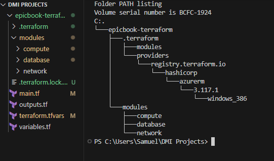

---

## Tech Stack

**Infrastructure as Code:**
- Terraform (Multi-workspace configuration)
- Azure Resource Manager (azurerm provider)

**Cloud Platform:**
- Microsoft Azure
- Azure Blob Storage (Remote state backend)

**Application Stack:**
- Frontend: React SPA
- Backend: Node.js/Express REST API
- Database: Azure MySQL Flexible Server

**Operating System:**
- Ubuntu 22.04 LTS

---

## Project Structure

```
epicbook-terraform/
│
├── main.tf                    # Root module orchestration
├── variables.tf               # Variable definitions
├── outputs.tf                 # Output values
├── backend.tf                 # Remote state configuration
├── terraform.tfvars           # Variable values (gitignored)
├── .gitignore                 # Git exclusions
│
├── modules/
│   ├── compute/
│   │   ├── main.tf           # VM, public IP, NIC
│   │   ├── cloud-init.yaml   # VM initialization script
│   │   ├── variables.tf
│   │   └── outputs.tf
│   │
│   ├── database/
│   │   ├── main.tf           # MySQL Flexible Server
│   │   ├── variables.tf
│   │   └── outputs.tf
│   │
│   └── network/
│       ├── main.tf           # VNet, subnets, NSGs
│       ├── variables.tf
│       └── outputs.tf
│
└── screenshots/              # Documentation images
```

---

## Infrastructure Components

### Remote State Backend

**Azure Blob Storage Configuration:**
- Storage Account: `tfstateakin`
- Container: `tfstate`
- State Files:
  - `epicbook.tfstate` (default workspace)
  - `epicbook.tfstateenv:dev` (development)
  - `epicbook.tfstateenv:prod` (production)
- Features: Automatic state locking with Azure Blob Lease

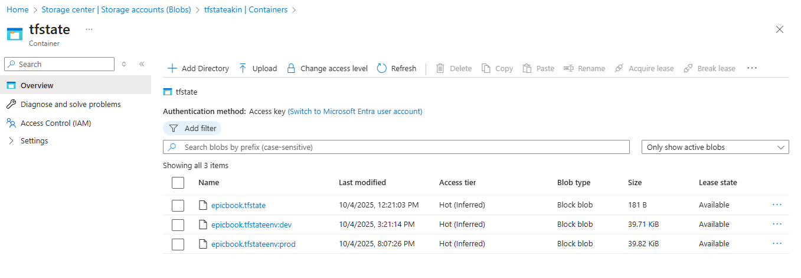

### Resource Groups

| Environment | Resource Group | Location | Purpose |
|-------------|---------------|----------|---------|
| Development | dev-epicbook-rg | North Europe | Dev resources |
| Production | prod-epicbook-rg | West Europe | Prod resources |

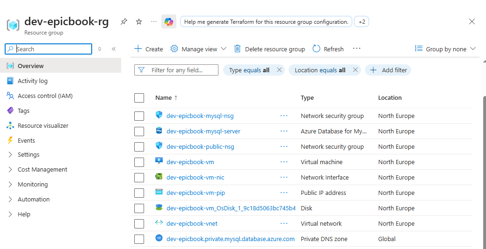

### Network Infrastructure

**Development Network:**
- VNet: `dev-epicbook-vnet` (10.0.0.0/16)
- Public Subnet: 10.0.1.0/24
- Private Subnet (MySQL): 10.0.2.0/24

**Production Network:**
- VNet: `prod-epicbook-vnet` (10.1.0.0/16)
- Public Subnet: 10.1.1.0/24
- Private Subnet (MySQL): 10.1.2.0/24

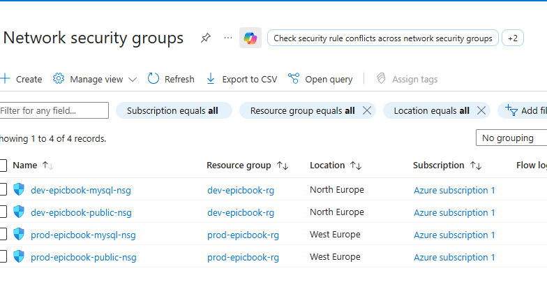

### Database Servers

**MySQL Flexible Server Configuration:**
- Private Access Only (VNet Integration)
- Private DNS Zone for name resolution
- SSL/TLS enforced
- Automated backups (7-day retention)
- Development: Burstable_B1ms
- Production: Standard_D2ds_v4

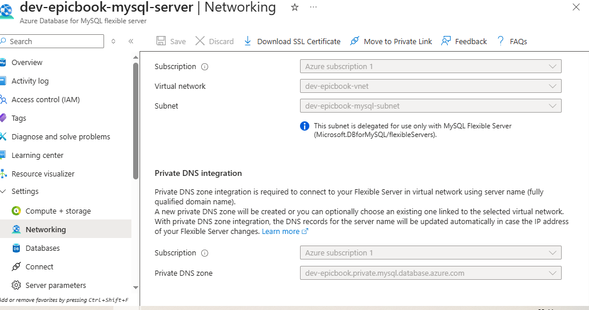

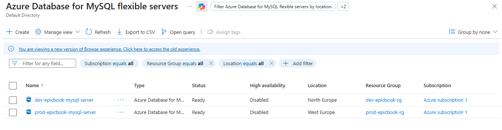

### Virtual Machines

**Development VM:**
- Name: `dev-epicbook-vm`
- Size: Standard_B1s (1 vCPU, 1 GB RAM)
- OS: Ubuntu 22.04 LTS
- Public IP: 20.166.18.1

**Production VM:**
- Name: `prod-epicbook-vm`
- Size: Standard_B2s (2 vCPUs, 4 GB RAM)
- OS: Ubuntu 22.04 LTS
- Public IP: 172.201.153.66

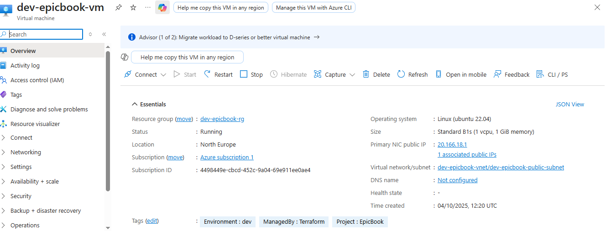

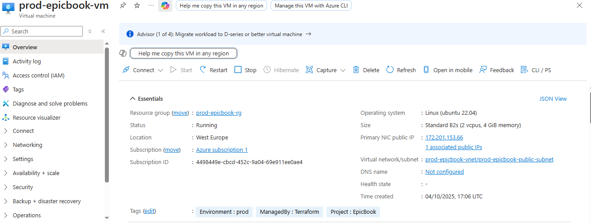

---

## Getting Started

### Prerequisites

```bash
# Required tools
terraform --version  # >= 1.5.0
az --version        # Azure CLI

# Azure authentication
az login
az account set --subscription "your-subscription-id"
```

### Setup

1. **Clone the repository:**
```bash
git clone https://github.com/yourusername/epicbook-terraform-azure.git
cd epicbook-terraform-azure
```

2. **Configure variables:**
```bash
# Create terraform.tfvars from example
cp terraform.tfvars.example terraform.tfvars

# Edit with your values
nano terraform.tfvars
```

3. **Initialize Terraform:**
```bash
terraform init
```

---

## Deployment

### Workspace Management

Terraform workspaces enable managing multiple environments from a single codebase:

```bash
# Create development workspace
terraform workspace new dev
terraform workspace select dev

# Create production workspace
terraform workspace new prod
terraform workspace select prod

# List all workspaces
terraform workspace list
```

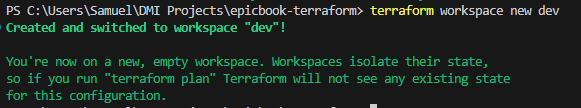

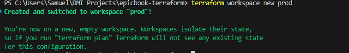

### Deploy Development Environment

```bash
terraform workspace select dev
terraform plan -out=dev.tfplan
terraform apply dev.tfplan
```

### Deploy Production Environment

```bash
terraform workspace select prod
terraform plan -out=prod.tfplan
terraform apply prod.tfplan
```

### Retrieve Outputs

```bash
# Get VM public IP
terraform output vm_public_ip

# Get MySQL FQDN
terraform output mysql_fqdn
```

---

## Screenshots

### Application - Development Environment

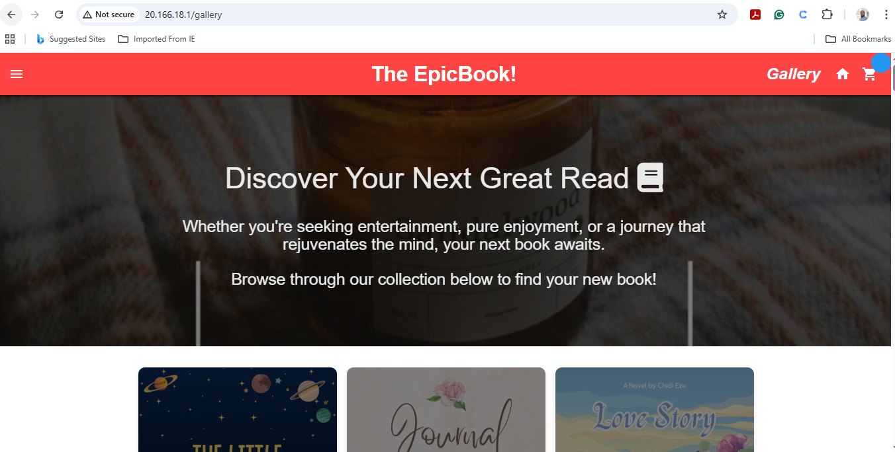

**Access:** http://20.166.18.1/gallery  
**Environment:** Development  
**Region:** North Europe

### Application - Production Environment

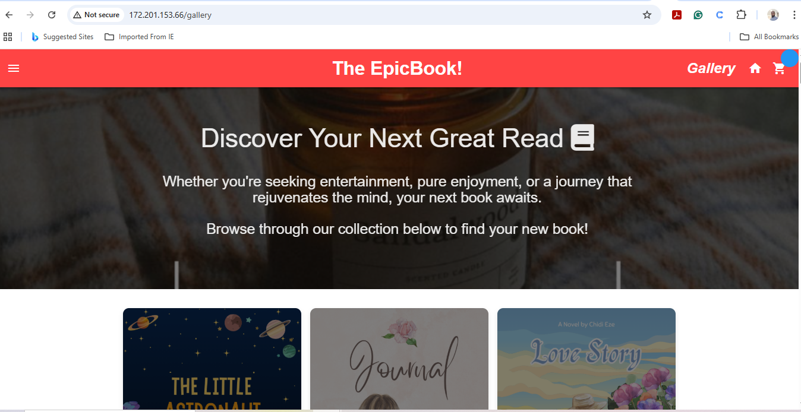

**Access:** http://172.201.153.66/gallery  
**Environment:** Production  
**Region:** West Europe

### System Information

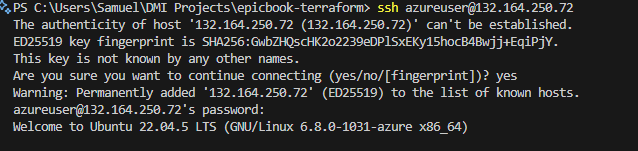

- OS: Ubuntu 22.04 LTS
- System Load: 0.79
- Memory: 11.6% usage
- Status: Running

### State Locking Verification

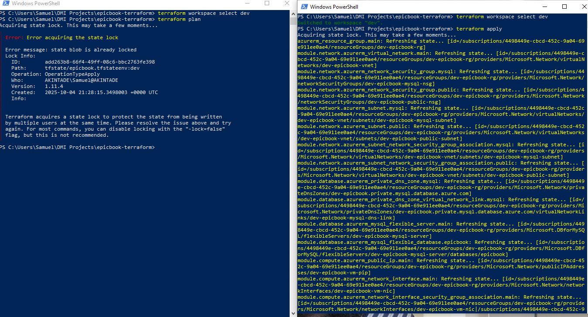

Concurrent modification protection verified through terminal testing. Azure Blob Lease mechanism successfully prevents simultaneous state updates.

---

## Key Features

### Multi-Environment Management
Terraform workspaces provide complete environment isolation while sharing the same infrastructure code. Each workspace maintains its own state file in Azure Blob Storage.

### Secure Database Access
MySQL Flexible Server is deployed with private access only, accessible exclusively through VNet integration. No public endpoints are exposed, reducing the attack surface.

### Infrastructure as Code
All infrastructure is version-controlled and reproducible. Changes are tracked, reviewed, and deployed through standard Git workflows.

### State Locking
Azure Blob Storage lease mechanism prevents concurrent Terraform operations, ensuring state file integrity during team collaboration.

### Automated Provisioning
Cloud-init scripts handle complete application setup including dependencies, database configuration, and application deployment.

---

## Production Considerations

### Implemented Security Measures
- Private database networking (no public endpoints)
- Network security groups with restrictive rules
- SSL/TLS enforcement on database connections
- Separate subnets for application and database tiers
- Public key authentication for SSH

### Recommendations for Production Scale

**High Availability:**
- Multi-region active-passive deployment
- Azure Traffic Manager for automatic failover
- Database read replicas for geographic distribution
- VM availability sets or scale sets

**Security Enhancements:**
- Azure Key Vault for secrets management
- Managed identities for authentication
- Azure Private Link for all PaaS services
- Web Application Firewall (WAF)
- DDoS Protection Standard

**Monitoring & Operations:**
- Azure Monitor and Application Insights
- Log Analytics workspace integration
- Custom alerts and dashboards
- Automated backup testing
- Cost monitoring and budgets

**CI/CD Pipeline:**
- GitHub Actions or Azure DevOps integration
- Automated terraform plan on pull requests
- Policy validation with Azure Policy
- Security scanning (Checkov, tfsec)
- Blue-green deployments

**Performance Optimization:**
- Azure CDN for static content delivery
- Application Gateway for load balancing
- Auto-scaling based on metrics
- Database query optimization
- Redis cache for session management

---

## Cost Estimation

### Development Environment
- VM (Standard_B1s): ~$10/month
- MySQL (Burstable_B1ms): ~$15/month
- Storage: ~$2/month
- Network: ~$5/month
- **Total: ~$32/month**

### Production Environment
- VM (Standard_B2s): ~$35/month
- MySQL (Standard_D2ds_v4): ~$120/month
- Storage: ~$10/month
- Network: ~$15/month
- **Total: ~$180/month**

Note: Costs vary by region and actual usage patterns.

---

## Cleanup

### Destroy Infrastructure

```bash
# Destroy production environment
terraform workspace select prod
terraform destroy

# Destroy development environment
terraform workspace select dev
terraform destroy

# Delete workspaces
terraform workspace select default
terraform workspace delete dev
terraform workspace delete prod
```

### Remove State Backend (Optional)

```bash
# Delete storage account and resource group
az storage account delete --name tfstateakin --resource-group tfstate-rg --yes
az group delete --name tfstate-rg --yes
```

---

## Contributing

Contributions are welcome. Please open an issue to discuss proposed changes before submitting a pull request.

---

## License

This project is available for educational and portfolio purposes.

---

## Resources

- [Terraform Azure Provider Documentation](https://registry.terraform.io/providers/hashicorp/azurerm/latest/docs)
- [Azure MySQL Flexible Server](https://learn.microsoft.com/en-us/azure/mysql/flexible-server/)
- [Terraform Workspaces](https://developer.hashicorp.com/terraform/language/state/workspaces)
- [Azure Virtual Network](https://learn.microsoft.com/en-us/azure/virtual-network/)

---

**Author:** Aduroja Akintade  
**Project Type:** Cloud Infrastructure Portfolio Project  
**Date:** October 2025
